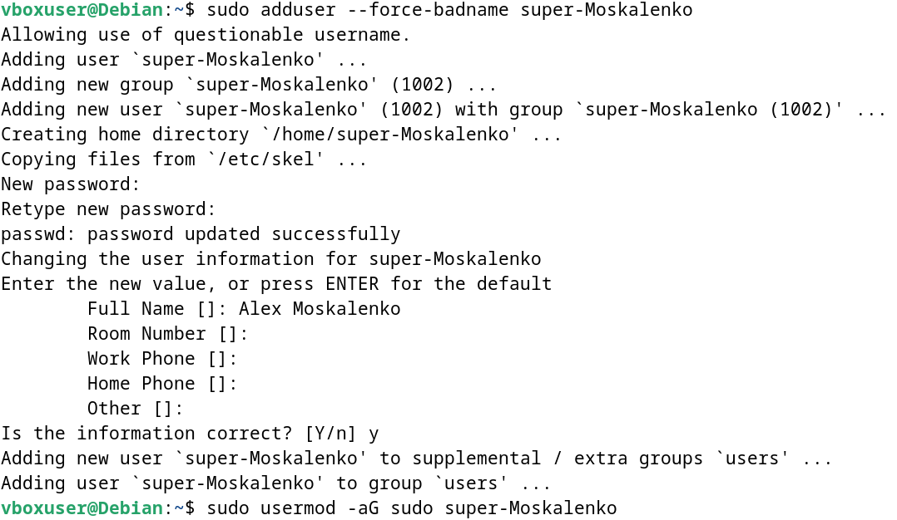
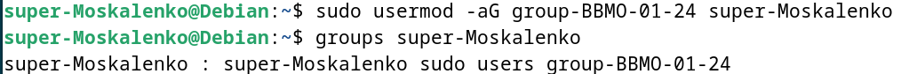
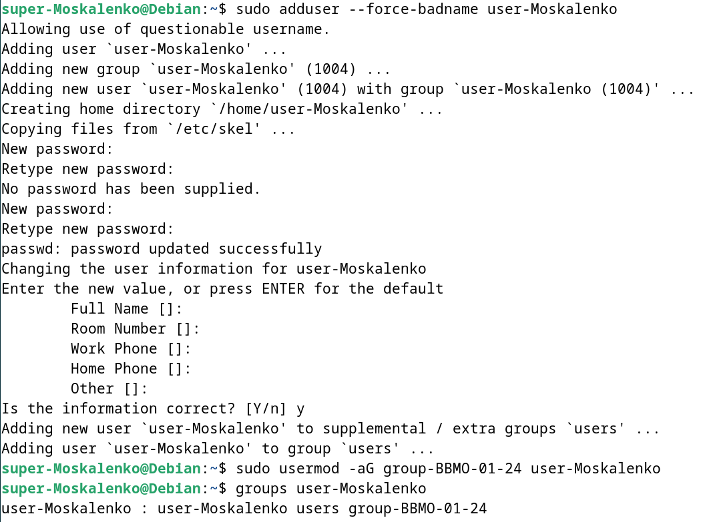
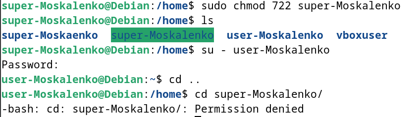
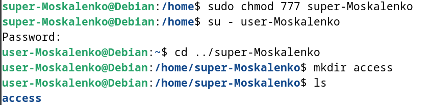

# TOIB_Practice

Задание 1:
Напишите программу на Python, чтобы проверить, соответствует ли пароль следующим критериям:

* длина не менее 8 символов и
* содержит как минимум одну прописную букву, одну строчную букву, одну цифру и один специальный символ (!, @, #, $, % или &).
* если пароль соответствует критериям, выведите в консоль сообщение «Действительный пароль». Если он не соответствует критериям, напечатайте сообщение «Пароль не соответствует требованиям».

Решение находить в файле Practice1.py

Задание 2:

Создать виртуальную машину на базе ОС Debian 12
Создать пользователя super-{ФИО}, наделить его привилегиями суперпользователя

Зайти под созданным пользователем и создать группу group-{группа}

Добавить пользователя super-{ФИО} в группу group-{группа}. Продемонстрировать наличие пользователя в группе

Создать пользователя user-{ФИО}, добавить его в группу group-{группа}

Наделить полномочиями (с использованием механизмов дискреционного управления доступом chmod) пользователя user-{ФИО} по созданию и удалению файлов в домашнем каталоге пользователя super-{ФИО}

Продемонстрировать работу механизмов разграничения доступа.

